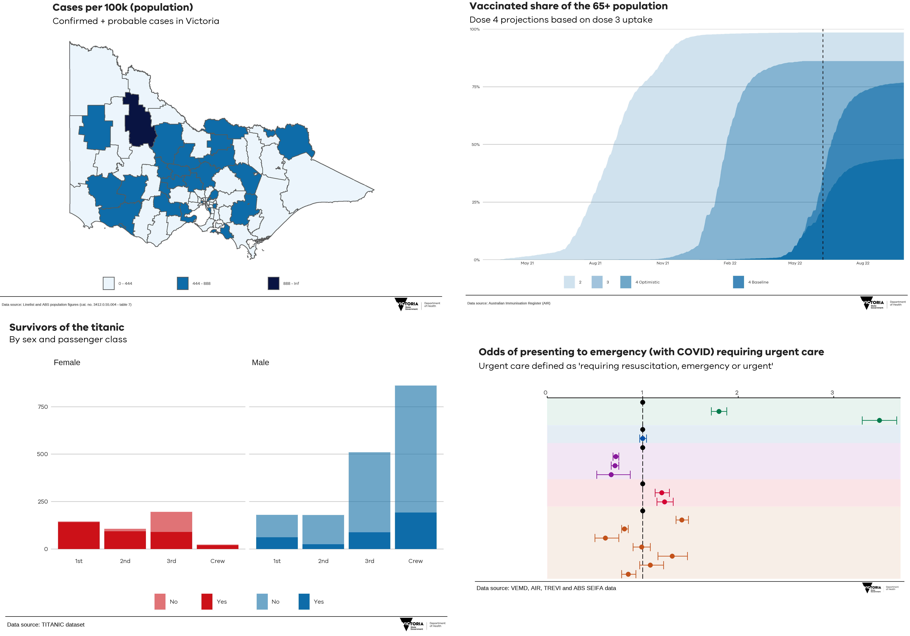
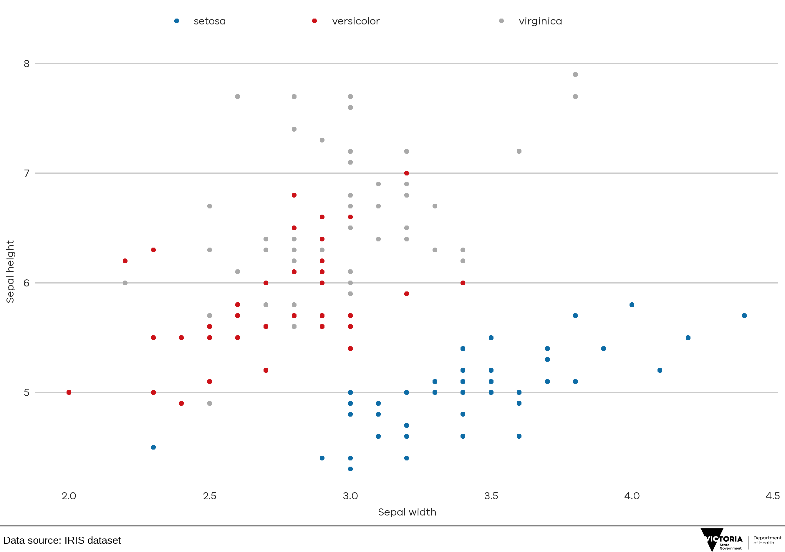
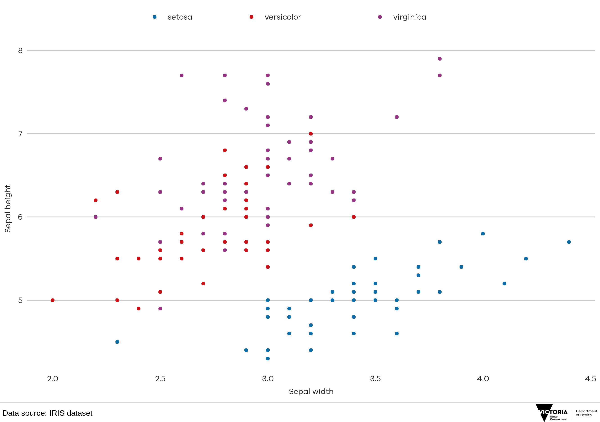
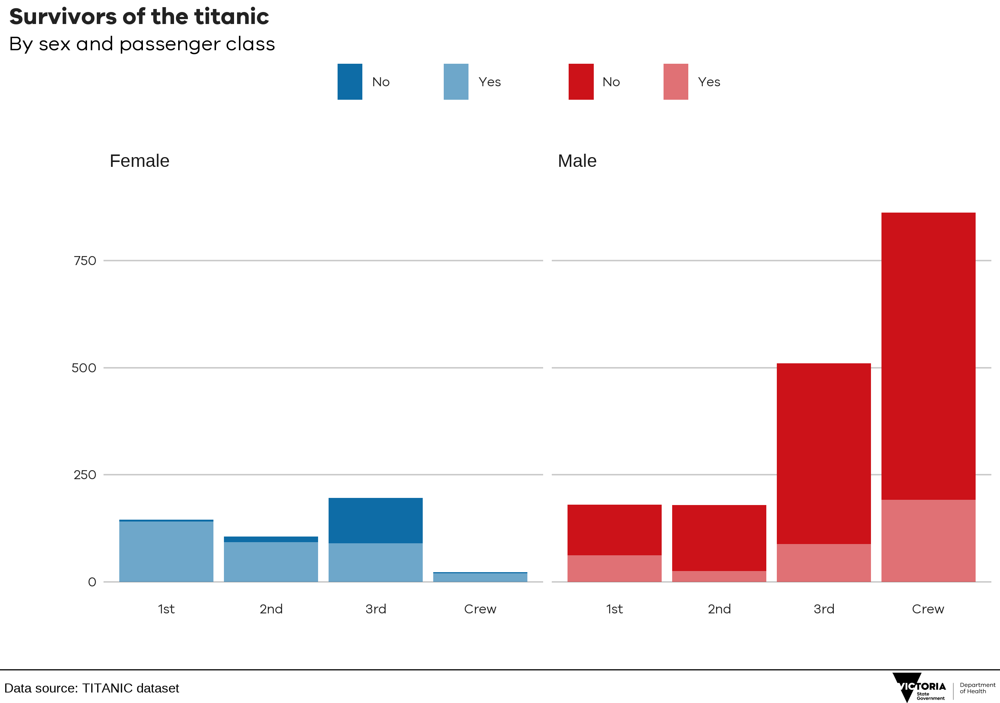
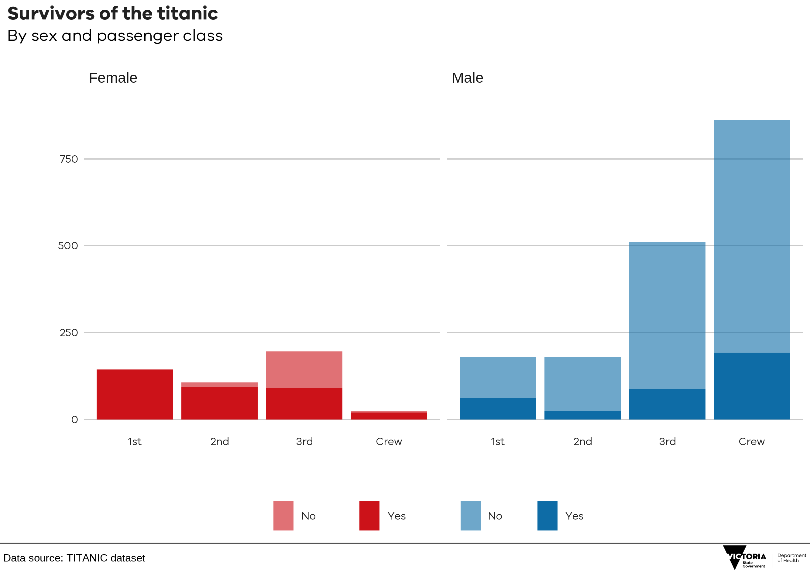

This repo contains the functions of the `maecharts` package, which once installed locally, provides helpful functions for creating and exporting  graphics made in ggplot in the style used by the Modelling and Analytical Epidemiology (MAE) team.



## Installing maecharts

`maecharts` is not on CRAN, so you will have to install it directly from DevOps using `remotes`. 

If you do not have the `remotes` package installed, you will have to run the first line in the code below as well. 

```
# install.packages('remotes')
remotes::install_git("https://dev.azure.com/dhhs-crt/ANALYTICS%20DIME%20ICCOM/_git/maecharts", git = "external")
```

## Using the functions

The package has four functions for plots: `theme_mae()`, `mae_save()`, `scale_colour_mae()`, `scale_fill_mae()`.

A basic explanation and summary here:

### `theme_mae()`

1. `theme_mae()`: has no arguments and is added to the ggplot chain after you have created a plot. What it does is generally makes text size, font and colour, axis lines, axis text and many other standard chart components into MAE style, which has been formulated with the help of members of the MAE team. 

The function is pretty basic and does not change or adapt based on the type of chart you are making, so in some cases you will need to make additional `theme` arguments in your ggplot chain if you want to make any additions or changes to the style, for example to add or remove gridlines etc. Also note that colours for lines in the case of a line chart or bars for a bar chart, do not come out of the box from the `theme_mae` function, but need to be explicitly set using the `scale_colour_mae() and scale_fill_mae()` functions.

Example of how it is used in a standard workflow:

```
iris_species <- iris %>%
 ggplot() +
 geom_point(aes(x = Sepal.Length, y = Sepal.Width, colour = Species)) +
 theme_mae()
 
```
### `mae_save`

2. `mae_save`: will save out your plot with the correct guidelines for publication for a MAE graphic. It is made up of functions that will left align your title, subtitle and source, add the Victorian Department of Health logo at the bottom right and save it to your specified location. The function has six arguments, three of which need to be explicitly set and three that are defaults unless you overwrite them.  

Here are the function arguments:
`finalise_plot(plot_name, source_name, save_filepath, width_pixels, height_pixels, logo_image_path)`

* `plot_name`: the variable name that you have called your plot, for example for the chart example above `plot_name` would be `"iris_species"`    
*  `source_name`: the source text that you want to appear at the bottom left corner of your plot. It will automatically add the text `"Data source:"` before it, so for example `source = "Australian Immunisation Register (AIR)"` would display `"Data source: Australian Immunisation Register"` to the bottom left of your chart.
* `save_filepath`: the precise filepath that you want your graphic to save to, including the `.png` extension at the end. This does depend on your working directory and if you are in a specific R project. An example of a relative filepath would be: `/charts/line_chart.png`.  
* `width_pixels`: this is set to 640px by default, so only call this argument and specify the width you want your chart to be. 
* `height_pixels`: this is set to 450px by default, so only call this argument and specify the height you want your chart to be. 
* `logo_image_path`: this argument specifies the path for the image/logo in the bottom right corner of the plot. The default is for the Victorian Department of Health PNG file , so do not specify the argument if you want it to appear without a logo. If you want to add your own logo, just specify the path to your PNG file. The package has been prepared with a wide and thin image in mind. 

Example of how the `mae_save()` is used in a standard workflow. This function is called once you have created and finalised your chart data, titles and added the `theme_mae()` to it (see above):

```
mae_save(
plot_name = iris_species,
source = "IRIS dataset",
save_filepath = "filename_that_my_plot_should_be_saved_to-nc.png",
width_pixels = 640,
height_pixels = 550)

```

### `scale_colour_mae and scale_fill_mae`

3. `scale_colour_mae` and `scale_fill_mae`: will add the MAE colour palette to your charts, it includes three separate colour palettes depending on the type of data being visualised ("categorical", "sequential" and "contrast"). The function has three arguments which all contain default values. 

* `num_highlight_colours`: The number of colours to highlight in your chart (categorical data only). The maximum is 3 with additional colours defaulting to grey, defaults to `2`. 
* `direction`: The argument `direction = F` will reverse the colour palette.
* `save_filepath`: The type of data being charted. Three options are available: "categorical", "sequential" and "contrast".

A quick look at how each option works. The default options will highlight all two colours in the chart below, greying out the last species (virginica)

```{r setup, include = F}
knitr::opts_chunk$set(warning = FALSE, message = FALSE, eval = FALSE) 
library(tidyverse)
library(devtools)
library(lubridate)
load_all()
```

```{r}

iris %>%
    ggplot() +
    geom_point(aes(x = Sepal.Width, y = Sepal.Length, colour = Species)) +
    scale_colour_mae(type = "categorical") + 
    theme_mae() +
    labs(x = "Sepal width", y = "Sepal height")

```

{width=650px height=450px}
If we want to highlight all 3 colours then we just add `scale_colour_mae(num_highlight_colours = 3)`

```{r}

iris %>%
    ggplot() +
    geom_point(aes(x = Sepal.Width, y = Sepal.Length, colour = Species)) +
    scale_colour_mae(num_highlight_colours = 3, type = "categorical") + 
    theme_mae() +
    labs(x = "Sepal width", y = "Sepal height")

```

{width=650px height=450px}

If we want to compare two distinct groups of data (with subgroups) we can use the `scale_colour_mae(type = "constrast")` option 

```{r}

t <- Titanic %>%
  as_tibble() %>%
  group_by(Class, Survived, Sex) %>%
  summarise(n = sum(n)) %>%
  ungroup() %>%
  mutate(legend = paste(Survived, Sex),
         legend = factor(legend, 
                         levels = c("No Female", "Yes Female", "No Male", "Yes Male"), 
                         labels = c("No ", "Yes ", "No", "Yes"))) %>%
  ggplot() +
  geom_col(aes(x = Class, y = n, fill = legend)) +
  facet_wrap(~Sex) +
  scale_fill_mae(type = "contrast") + 
  theme_mae() + 
  labs(title = "Survivors of the titanic", subtitle = "By sex and passenger class", x = "", y = "")
  
```

{width=650px height=450px}

There is two things I want to change about this chart, I would like the legend to be on the bottom and the colours to be reversed (dark colours beneath light colours). 

Placing the legend at the bottom is as easy as overwriting the `theme_mae` defaults by running a `theme(legend.position = "bottom")` after the `theme_mae()` call. You can also reverse the colour order quite simply by adding `scale_fill_mae(direction = F)`

```{r}

Titanic %>%
  as_tibble() %>%
  group_by(Class, Survived, Sex) %>%
  summarise(n = sum(n)) %>%
  ungroup() %>%
  mutate(legend = paste(Survived, Sex),
         legend = factor(legend, 
                         levels = c("No Female", "Yes Female", "No Male", "Yes Male"), 
                         labels = c("No ", "Yes ", "No", "Yes"))) %>%
  ggplot() +
  geom_col(aes(x = Class, y = n, fill = legend)) +
  facet_wrap(~Sex) +
  scale_fill_mae(type = "contrast", direction = F) + 
  theme_mae() + 
  theme(legend.position = "bottom") + 
  labs(title = "Survivors of the titanic", subtitle = "By sex and passenger class", x = "", y = "")
  
```

{width=650px height=450px}
