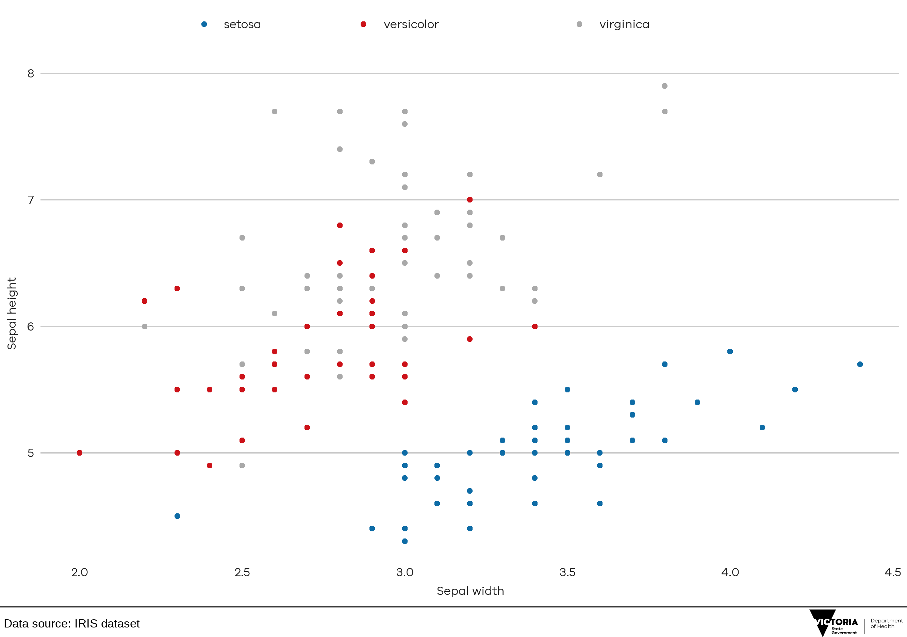
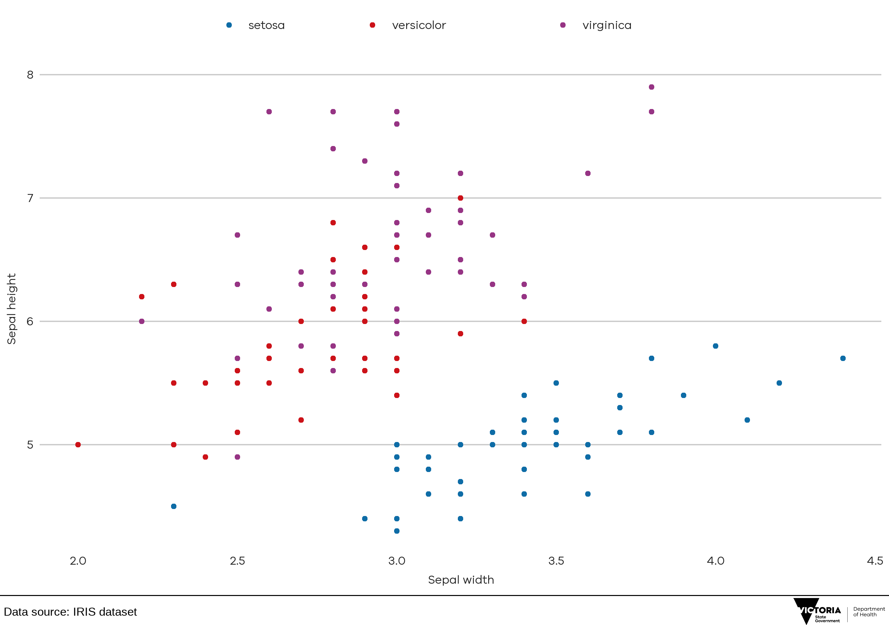
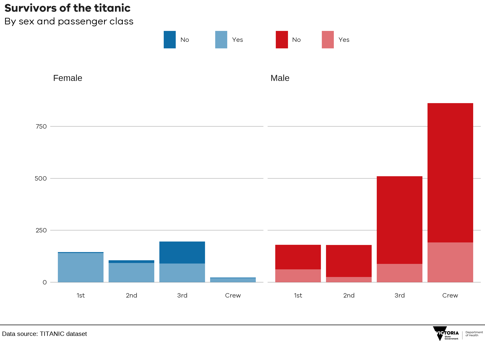
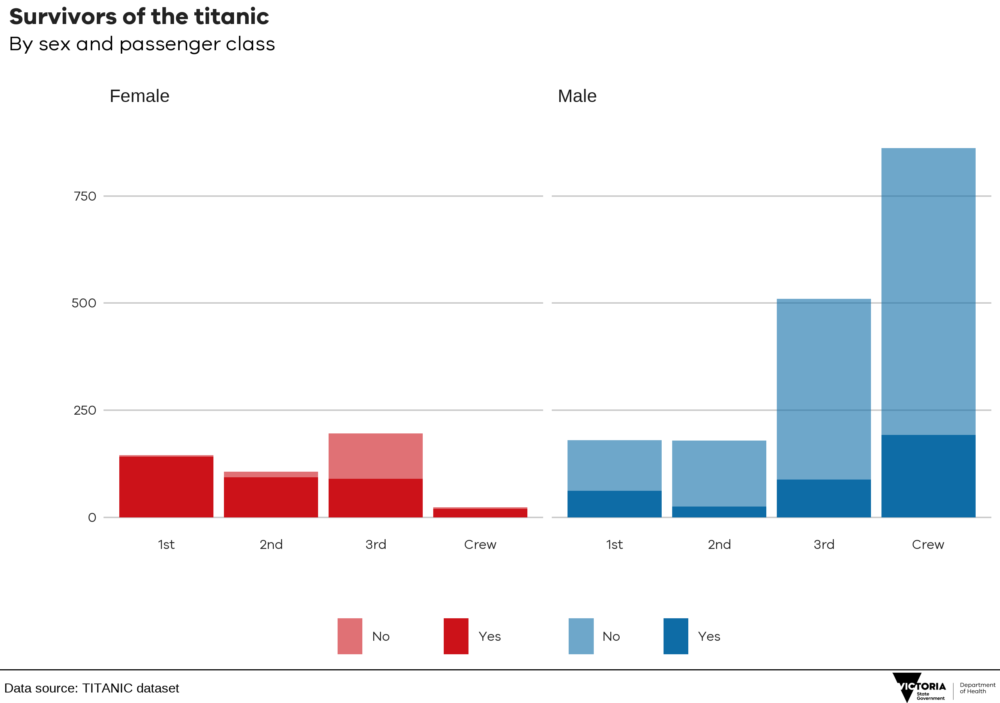

MAECHARTS
================

This repo contains the functions of the `maecharts` package, which once
installed locally, provides helpful functions for creating and exporting
graphics made in ggplot in the style used by the Modelling and
Analytical Epidemiology (MAE) team.


## Installing maecharts

`maecharts` is not on CRAN, so you will have to install it directly from
DevOps using `remotes`.

If you do not have the `remotes` package installed, you will have to run
the first line in the code below as well.

    # install.packages('remotes')
    remotes::install_git("https://dev.azure.com/dhhs-crt/ANALYTICS%20DIME%20ICCOM/_git/maecharts", git = "external")

## Using the functions

The package has four functions for plots: `theme_mae()`, `mae_save()`,
`scale_colour_mae()`, `scale_fill_mae()`.

A basic explanation and summary here:

### `theme_mae()`

1.  `theme_mae()`: has no arguments and is added to the ggplot chain
    after you have created a plot. What it does is generally makes text
    size, font and colour, axis lines, axis text and many other standard
    chart components into MAE style, which has been formulated with the
    help of members of the MAE team.

The function is pretty basic and does not change or adapt based on the
type of chart you are making, so in some cases you will need to make
additional `theme` arguments in your ggplot chain if you want to make
any additions or changes to the style, for example to add or remove
gridlines etc. Also note that colours for lines in the case of a line
chart or bars for a bar chart, do not come out of the box from the
`theme_mae` function, but need to be explicitly set using the
`scale_colour_mae() and scale_fill_mae()` functions.

Example of how it is used in a standard workflow:

``` 
iris_species <- iris %>%
 ggplot() +
 geom_point(aes(x = Sepal.Length, y = Sepal.Width, colour = Species)) +
 theme_mae()
 
```

### `mae_save`

2.  `mae_save`: will save out your plot with the correct guidelines for
    publication for a MAE graphic. It is made up of functions that will
    left align your title, subtitle and source, add the Victorian
    Department of Health logo at the bottom right and save it to your
    specified location. The function has six arguments, three of which
    need to be explicitly set and three that are defaults unless you
    overwrite them.

Here are the function arguments: `finalise_plot(plot_name, source_name,
save_filepath, width_pixels, height_pixels, logo_image_path)`

  - `plot_name`: the variable name that you have called your plot, for
    example for the chart example above `plot_name` would be
    `"iris_species"`  
  - `source_name`: the source text that you want to appear at the bottom
    left corner of your plot. It will automatically add the text `"Data
    source:"` before it, so for example `source = "Australian
    Immunisation Register (AIR)"` would display `"Data source:
    Australian Immunisation Register"` to the bottom left of your chart.
  - `save_filepath`: the precise filepath that you want your graphic to
    save to, including the `.png` extension at the end. This does depend
    on your working directory and if you are in a specific R project. An
    example of a relative filepath would be: `/charts/line_chart.png`.  
  - `width_pixels`: this is set to 640px by default, so only call this
    argument and specify the width you want your chart to be.
  - `height_pixels`: this is set to 450px by default, so only call this
    argument and specify the height you want your chart to be.
  - `logo_image_path`: this argument specifies the path for the
    image/logo in the bottom right corner of the plot. The default is
    for the Victorian Department of Health PNG file , so do not specify
    the argument if you want it to appear without a logo. If you want to
    add your own logo, just specify the path to your PNG file. The
    package has been prepared with a wide and thin image in mind.

Example of how the `mae_save()` is used in a standard workflow. This
function is called once you have created and finalised your chart data,
titles and added the `theme_mae()` to it (see above):

    mae_save(
    plot_name = iris_species,
    source = "IRIS dataset",
    save_filepath = "filename_that_my_plot_should_be_saved_to-nc.png",
    width_pixels = 640,
    height_pixels = 550)

### `scale_colour_mae and scale_fill_mae`

3.  `scale_colour_mae` and `scale_fill_mae`: will add the MAE colour
    palette to your charts, it includes three separate colour palettes
    depending on the type of data being visualised (“categorical”,
    “sequential” and “contrast”). The function has three arguments
    which all contain default values.

<!-- end list -->

  - `num_highlight_colours`: The number of colours to highlight in your
    chart (categorical data only). The maximum is 3 with additional
    colours defaulting to grey, defaults to `2`.
  - `direction`: The argument `direction = F` will reverse the colour
    palette.
  - `save_filepath`: The type of data being charted. Three options are
    available: “categorical”, “sequential” and “contrast”.

A quick look at how each option works. The default options will
highlight all two colours in the chart below, greying out the last
species (virginica)

``` r
iris %>%
    ggplot() +
    geom_point(aes(x = Sepal.Width, y = Sepal.Length, colour = Species)) +
    scale_colour_mae(type = "categorical") + 
    theme_mae() +
    labs(x = "Sepal width", y = "Sepal height")
```

 If we want to highlight all 3 colours
then we just add `scale_colour_mae(num_highlight_colours = 3)`

``` r
iris %>%
    ggplot() +
    geom_point(aes(x = Sepal.Width, y = Sepal.Length, colour = Species)) +
    scale_colour_mae(num_highlight_colours = 3, type = "categorical") + 
    theme_mae() +
    labs(x = "Sepal width", y = "Sepal height")
```



If we want to compare two distinct groups of data (with subgroups) we
can use the `scale_colour_mae(type = "constrast")` option

``` r
t <- Titanic %>%
  as_tibble() %>%
  group_by(Class, Survived, Sex) %>%
  summarise(n = sum(n)) %>%
  ungroup() %>%
  mutate(legend = paste(Survived, Sex),
         legend = factor(legend, 
                         levels = c("No Female", "Yes Female", "No Male", "Yes Male"), 
                         labels = c("No ", "Yes ", "No", "Yes"))) %>%
  ggplot() +
  geom_col(aes(x = Class, y = n, fill = legend)) +
  facet_wrap(~Sex) +
  scale_fill_mae(type = "contrast") + 
  theme_mae() + 
  labs(title = "Survivors of the titanic", subtitle = "By sex and passenger class", x = "", y = "")
```



There is two things I want to change about this chart, I would like the
legend to be on the bottom and the colours to be reversed (dark colours
beneath light colours).

Placing the legend at the bottom is as easy as overwriting the
`theme_mae` defaults by running a `theme(legend.position = "bottom")`
after the `theme_mae()` call. You can also reverse the colour order
quite simply by adding `scale_fill_mae(direction = F)`

``` r
Titanic %>%
  as_tibble() %>%
  group_by(Class, Survived, Sex) %>%
  summarise(n = sum(n)) %>%
  ungroup() %>%
  mutate(legend = paste(Survived, Sex),
         legend = factor(legend, 
                         levels = c("No Female", "Yes Female", "No Male", "Yes Male"), 
                         labels = c("No ", "Yes ", "No", "Yes"))) %>%
  ggplot() +
  geom_col(aes(x = Class, y = n, fill = legend)) +
  facet_wrap(~Sex) +
  scale_fill_mae(type = "contrast", direction = F) + 
  theme_mae() + 
  theme(legend.position = "bottom") + 
  labs(title = "Survivors of the titanic", subtitle = "By sex and passenger class", x = "", y = "")
```


